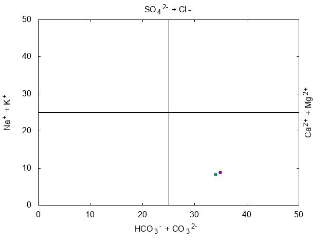

# Gnuplot Template – Langelier-Ludwig Diagram

(c) 2018 Matteo Paolieri - University of Florence

This Gnuplot script generates a **Langelier-Ludwig diagram**, a graphical representation used in water chemistry to assess whether a water sample is **corrosive**, **scaling**, or **balanced** with respect to **calcium carbonate (CaCO₃) saturation**.

This type of diagram is a powerful visualization tool derived from the **Langelier Saturation Index (LSI)**. It helps interpret how water chemistry parameters like **alkalinity**, **pH**, and **hardness** interact to predict whether water will **deposit scale** or **corrode metal surfaces**.

## How to Use

1. Prepare your input data in `data.txt`.
    - **Columns 1 & 2** → Bicarbonates vs. Na⁺ + K⁺ (to be plotted on x1y1 axes)
    - **Columns 3 & 4** → SO₄²⁻ vs. Ca²⁺ + Mg²⁺ (to be plotted on x2y2 axes)

2. Run the Gnuplot script:

   ```bash
   gnuplot LudwigLangelier.plt
   ```

3. The output graph will be saved as `LL-Graph.png`.

## Notes

The default Gnuplot command in the script:

```gnuplot
plot 'data.txt' u 1:2 axes x1y1 w p pt 7, '' u 3:4 axes x2y2 w p pt 7
```

This means:
- Plot columns 1 (x) and 2 (y) from `data.txt` using the **x1y1** axes.
- Then plot columns 3 (x) and 4 (y) using the **x2y2** axes.
- Use **point style 7** for both sets.

You are free to modify this line to fit your data. The template is designed to be flexible and can be extended to accommodate additional dimensions or custom styles.

This repository was created because no reusable Langelier-Ludwig diagram script was readily available online. Consider this a starting point for your own analyses or academic work.

## Example Output


